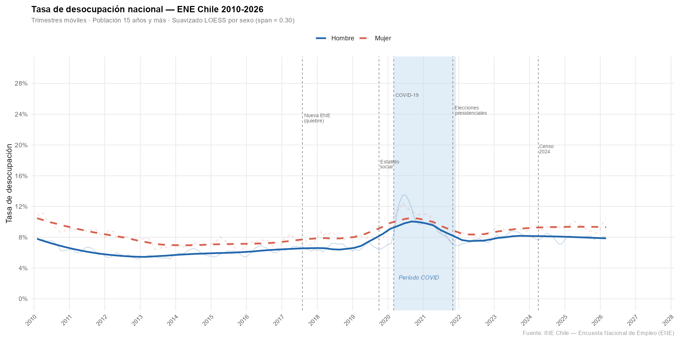
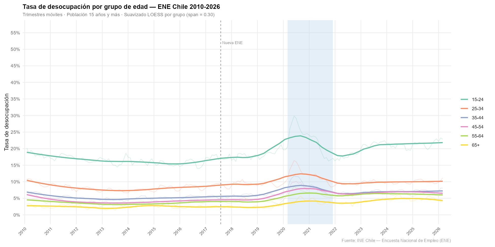
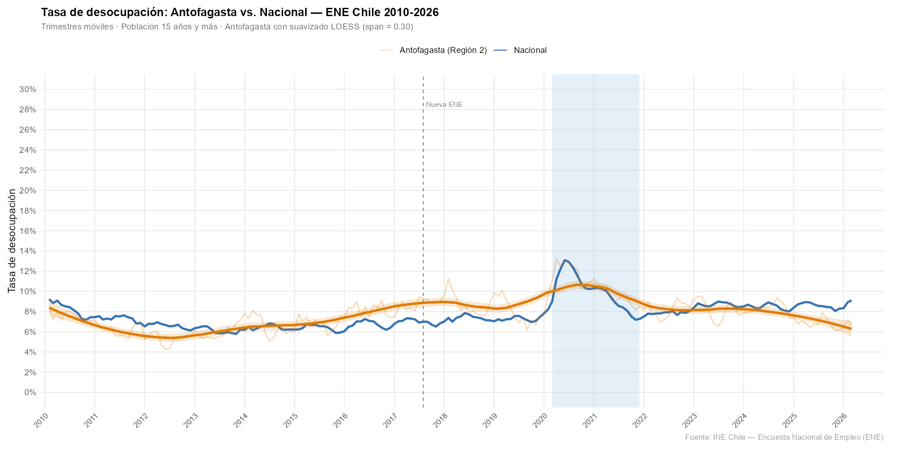
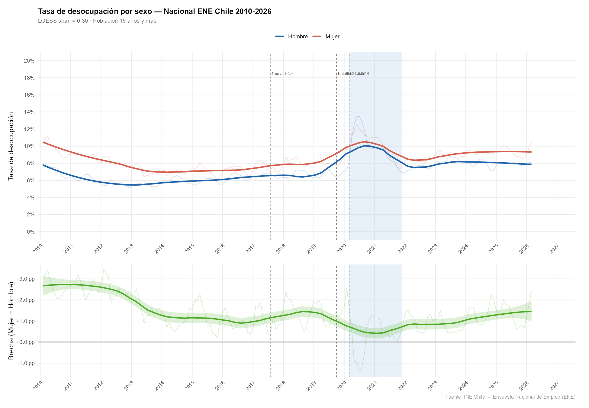
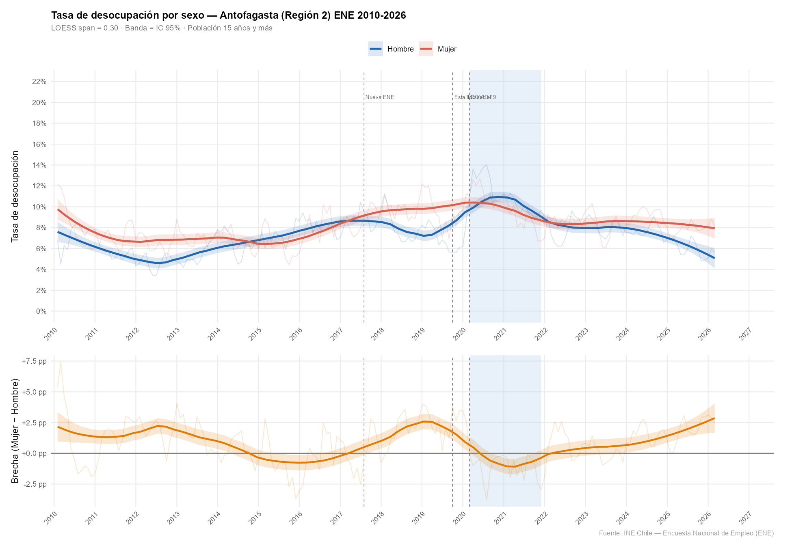
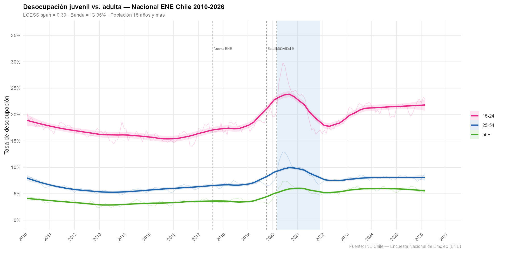
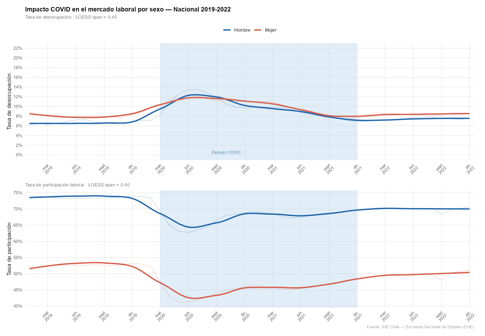

# HALLAZGOS — ENE INE Chile 2010-2026

> **Proyecto:** Análisis del mercado laboral chileno con microdatos de la Encuesta Nacional de Empleo (ENE)  
> **Autor:** Felipe Obregón  
> **Última actualización:** 10-09-2026

---

## 1. Resumen del Proyecto

Este proyecto descarga, consolida y analiza la totalidad de los microdatos públicos de la **Encuesta Nacional de Empleo (ENE)** del INE Chile para el período **2010–2026**, cubriendo 210 archivos CSV trimestrales (~7.3 GB). El objetivo central es caracterizar la evolución de las tasas de desocupación, ocupación y participación laboral a nivel nacional y con foco en la **Región de Antofagasta (Región 2)**, desagregando por sexo y grupo de edad.

El análisis abarca cinco épocas metodológicas del cuestionario ENE:

| Época | Período | Característica principal |
|-------|---------|-------------------------|
| 1 | 2010–2012 | ENE clásica (CIUO-88, CIIU Rev.3) |
| 2 | 2013–2016 | Incorporación rama CAENES |
| 3 | 2017–2019 | Nueva ENE (CIUO-08, nuevo marco muestral) |
| 4 | 2020–feb/2022 | Cuestionario COVID (migración, plataformas, turnos) |
| 5 | mar/2022–2026 | Estructura estable actual |

Los quiebres metodológicos entre épocas (especialmente la transición 2016→2017) deben considerarse al interpretar tendencias de largo plazo.

---

## 2. Descripción de Scripts

### Scripts Python — Descarga y exploración

| Script | Propósito |
|--------|-----------|
| `investigar_ine.py` | Exploración inicial del sitio INE: detecta la estructura de URLs, formatos disponibles y nomenclatura de archivos. Genera `pagina_principal.html` como respaldo. |
| `descargar_ene.py` | Primera versión del descargador: itera sobre el catálogo del sitio INE y descarga archivos CSV individualmente con reintentos básicos. |
| `descargar_ene_v2.py` | Versión mejorada: descarga el manifiesto completo (`manifest_completo.json`, 1.270 entradas), valida URLs y gestiona errores de red de forma robusta. |
| `descarga_csv.py` | Script de producción: descarga masiva de todos los CSV organizados por año en carpetas `2010/`, `2011/`, …, `2026/`. Implementa control de archivos ya descargados para reanudar descargas interrumpidas. |

### Scripts R — Consolidación y análisis

| Script | Propósito |
|--------|-----------|
| `01_consolidar.R` | Lee los 210 archivos trimestrales, extrae las variables comparables entre épocas (`region`, `sexo`, `edad`, `activ`, `fact_cal`), y genera el archivo consolidado `ene_consolidado.rds` (~152 MB). Maneja automáticamente variables ausentes según época. |
| `02_eda.R` | Análisis exploratorio principal: calcula tasas nacionales (desocupación, ocupación, participación) por trimestre, genera los gráficos 01–03, y exporta `resultados/tabla_resumen_anual.csv` con tasas anuales nacionales y de Antofagasta. |
| `03_sexo_edad.R` | Análisis desagregado: tasas por sexo (con brecha de género), grupos de edad simplificados (15-24 / 25-54 / 55+), zoom al período COVID y comparación Antofagasta. Genera los gráficos 04–07 y `resultados/tabla_sexo_anual.csv`. |

---

## 3. Tabla de Hallazgos Principales por Año

### 3.1 Tasas nacionales y de Antofagasta

| Año | TD Nacional (%) | TO Nacional (%) | TP Nacional (%) | TD Antofagasta (%) | Brecha Antof−Nac (pp) |
|-----|:--------------:|:--------------:|:--------------:|:-----------------:|:--------------------:|
| 2010 | 8.22 | 55.21 | 60.16 | 7.56 | −0.66 |
| 2011 | 7.32 | 56.97 | 61.47 | 6.27 | −1.05 |
| 2012 | 6.58 | 57.43 | 61.48 | 5.30 | −1.28 |
| 2013 | 6.13 | 57.82 | 61.60 | 5.94 | −0.19 |
| 2014 | 6.42 | 57.90 | 61.87 | 6.62 | +0.20 |
| 2015 | 6.37 | 58.06 | 62.01 | 6.77 | +0.40 |
| 2016 | 6.68 | 58.00 | 62.15 | 8.15 | +1.47 |
| 2017 | 6.97 | 58.32 | 62.69 | 8.66 | +1.69 |
| 2018 | 7.36 | 58.35 | 62.98 | 8.71 | +1.35 |
| 2019 | 7.24 | 58.27 | 62.82 | 8.02 | +0.78 |
| **2020** | **10.70** | **49.98** | **55.97** | **11.32** | **+0.62** |
| 2021 | 8.85 | 52.15 | 57.21 | 9.53 | +0.68 |
| 2022 | 7.85 | 55.03 | 59.71 | 8.14 | +0.29 |
| 2023 | 8.67 | 55.87 | 61.17 | 8.19 | −0.48 |
| 2024 | 8.47 | 56.74 | 61.99 | 8.36 | −0.11 |
| 2025 | 8.56 | 56.76 | 62.08 | 6.84 | −1.72 |
| 2026* | 8.79 | 56.84 | 62.32 | 6.74 | −2.05 |

*2026: datos parciales (enero–marzo).  
**TD** = Tasa de desocupación · **TO** = Tasa de ocupación · **TP** = Tasa de participación.

### 3.2 Brecha de género en la tasa de desocupación (Mujer − Hombre, pp)

| Año | TD Hombre Nac (%) | TD Mujer Nac (%) | Brecha Nac (pp) | Brecha Antof (pp) |
|-----|:-----------------:|:----------------:|:---------------:|:-----------------:|
| 2010 | 7.18 | 9.80 | +2.62 | +1.16 |
| 2012 | 5.56 | 8.06 | +2.50 | +1.80 |
| 2014 | 6.02 | 6.98 | +0.96 | +0.26 |
| 2016 | 6.30 | 7.22 | +0.92 | −0.12 |
| 2018 | 6.75 | 8.18 | +1.43 | +1.66 |
| 2019 | 6.66 | 8.03 | +1.37 | +2.56 |
| 2020 | 10.54 | 10.94 | +0.40 | −0.38 |
| 2021 | 8.63 | 9.16 | +0.53 | −1.22 |
| 2023 | 8.35 | 9.10 | +0.75 | +0.04 |
| 2025 | 8.02 | 9.28 | +1.26 | +1.71 |
| 2026* | 7.99 | 9.82 | +1.83 | +2.83 |

---

#### 4. Interpretación de Gráficos

##### **Tasa de desocupación nacional por sexo, 2010–2026 (con LOESS y hitos)**

- La desocupación femenina se mantuvo consistentemente por encima de la masculina durante toda la serie, con una brecha media de ~1.5 pp en el período pre-COVID.
- Se observa una **tendencia descendente** desde el pico post-crisis de 2010 (8.2%) hasta el mínimo de 2013 (6.1%), seguida de una leve alza hacia 2018–2019.
- La **Nueva ENE (2017)** produce un quiebre metodológico visible: la serie mujer presenta un salto ascendente que parcialmente refleja el cambio de marco muestral y no necesariamente deterioro real del mercado.
- El **Estallido Social (oct-2019)** anticipa una ligera presión al alza antes del shock COVID.
- El **período COVID (2020–2021)** es el evento más disruptivo: la TD nacional sube de ~7% a un máximo de ~14% (trimestres móviles), con posterior recuperación hacia 2022–2023. La brecha de género se comprimió durante COVID porque la desocupación masculina subió más abruptamente.
- En 2023–2026 la desocupación se estabiliza en torno al 8.5–9%, por encima del nivel pre-COVID, sin señal clara de convergencia hacia los mínimos de 2012–2013.

---

##### **Tasa de desocupación por grupo etario (6 grupos), 2010–2026**

- El grupo **15–24 años** (desocupación juvenil) es el de mayor volatilidad y nivel, oscilando entre el 15% y el 50% según trimestre. El pico COVID superó el 30% en tendencia LOESS.
- Los grupos **25–34** y **35–44** presentan niveles intermedios y son los más afectados en términos absolutos de personas dado su tamaño.
- Los grupos de **55+ y 65+** exhiben las tasas más bajas y menor sensibilidad cíclica, coherente con mayor selectividad en la búsqueda de empleo y menor participación laboral.
- El quiebre de la **Nueva ENE (2017)** es especialmente pronunciado en el grupo 15–24, cuya tasa experimenta un salto discontinuo que debe interpretarse con cautela metodológica.
- La recuperación post-COVID fue más lenta en los jóvenes: en 2023–2026 su tasa se mantiene ~5 pp por encima del nivel previo al COVID.

---

##### **Antofagasta (Región 2) vs. Nacional, 2010–2026**

- Hasta 2013, Antofagasta tenía una TD **inferior** a la nacional en ~1 pp, posiblemente por el auge minero y la alta demanda de empleo.
- A partir de 2014–2015 la situación se **invierte**: la región supera al promedio nacional y la brecha se amplía hasta ~1.7 pp en 2017–2018, coincidiendo con la desaceleración del ciclo minero del cobre.
- Durante COVID, Antofagasta registró la misma magnitud de shock que el nivel nacional (+0.62 pp de brecha), pero con mayor volatilidad trimestral dada la menor muestra regional.
- El rasgo más destacado del período reciente (2023–2026) es que **Antofagasta volvió a situarse por debajo de la media nacional**, con una brecha negativa que alcanzó −2.05 pp en 2026 (enero–marzo). Esto sugiere una recuperación liderada por el sector minero post-pandemia.

---

##### **Brecha de género nacional (TD y panel de brecha), 2010–2026**

- El panel superior confirma la persistencia histórica de la brecha: la TD femenina supera en promedio 1.5–2.5 pp a la masculina en el período 2010–2019.
- El panel inferior (brecha Mujer − Hombre) muestra que la brecha se **comprimió marcadamente durante COVID** (llegando a ~0.4 pp), porque el mercado laboral masculino es más sensible a las contracciones económicas, especialmente en sectores como construcción y transporte.
- Tras COVID, la brecha se recuperó hacia los valores históricos: en 2025–2026 alcanza 1.26–1.83 pp, con tendencia al alza que podría indicar mayor dificultad de reinserción femenina post-pandemia.

---

##### **Brecha de género en Antofagasta (TD y panel de brecha), 2010–2026**

- Antofagasta muestra una estructura de género atípica: en varios períodos (2015–2016, 2020–2021) la brecha se **invierte**, es decir, los hombres tienen mayor TD que las mujeres. Esto refleja el carácter masculinizado del sector minero: en fases de contracción, el desempleo masculino sube más que el femenino.
- La banda de incertidumbre (IC 95%) del LOESS es notablemente más amplia que en el gráfico nacional, evidenciando la menor precisión de las estimaciones regionales por tamaño de muestra.
- En 2019 se observó la mayor brecha en favor de las mujeres (+2.56 pp), seguida de una inversión en 2021 (−1.22 pp), lo que marca la asimetría sectorial de los shocks en la región.
- En 2026 la brecha vuelve a ser positiva (+2.83 pp), la más alta de toda la serie para Antofagasta, señal de que la recuperación minera beneficia más al empleo masculino.

---

##### **Desocupación juvenil (15-24) vs. adulta (25-54) y mayores (55+), 2010–2026**

06_desocupacion_grupos_edad

- La brecha entre desocupación juvenil y adulta es estructuralmente grande: el grupo 15–24 duplica o triplica la TD del grupo 25–54 en todos los años.
- COVID impactó de forma diferencial: el grupo 25–54 registró el mayor salto absoluto en puntos porcentuales (de ~5% a ~12%), mientras que en 15–24 el shock fue relativamente menor en términos de variación relativa dado su ya elevado nivel base.
- El grupo 55+ mostró la mayor resiliencia al COVID, con un pico inferior al 10%, y fue el primero en recuperarse.
- En el período 2023–2026, la desocupación juvenil (15–24) permanece por encima del 20% en la tendencia LOESS, muy por encima del mínimo de ~15% registrado en 2012–2013.

---

##### **Zoom período COVID (2019–2022): TD y tasa de participación por sexo**

- El panel superior (TD) muestra el rápido ascenso hacia la desocupación máxima en el segundo trimestre de 2020, con ambos sexos alcanzando ~13–14% simultáneamente.
- El panel inferior (tasa de participación) es el hallazgo más revelador: **las mujeres registraron una caída de participación mucho más pronunciada** (de ~48% a ~38%), mientras los hombres cayeron de ~70% a ~63%. Esto indica un fenómeno de **desaliento selectivo femenino**: muchas mujeres dejaron de buscar empleo (salen de la PEA) en lugar de aparecer como desocupadas.
- La recuperación de la participación femenina fue más lenta y aún en 2022 no había recuperado completamente el nivel pre-COVID, lo que explica por qué la brecha de desocupación se comprimió: el denominador (PEA femenina) cayó más que el numerador.

---

## 5. Próximos Pasos Pendientes

### Análisis estadístico
- [ ] **Modelo de regresión de series de tiempo** (ARIMA o regresión con variables dummy de época y eventos) para descomponer tendencia, estacionalidad y efectos de hitos (COVID, quiebre 2017, estallido social).
- [ ] **Análisis de convergencia regional**: comparar todas las regiones para contextualizar la trayectoria de Antofagasta dentro del país.
- [ ] **Desagregación por rama de actividad** (variable CAENES, disponible desde 2013): cuantificar el peso del sector minero en la dinámica de Antofagasta.
- [ ] **Análisis de subempleo y condiciones de empleo** con variables adicionales disponibles en las épocas 4 y 5 (trabajo en plataformas, trabajo a tiempo parcial involuntario).

### Visualización
- [ ] **Mapa choropleth** de tasas regionales por año con `sf` y los límites administrativos de Chile para comunicar heterogeneidad geográfica.
- [ ] **Dashboard interactivo** con `flexdashboard` o Shiny que permita explorar la serie por región, grupo de edad y sexo con filtros dinámicos.
- [ ] **Gráfico de calor (heatmap) trimestral** con eje x = año, eje y = mes, color = TD nacional, para visualizar estacionalidad.

### Validación y reproducibilidad
- [ ] **Comparar estimaciones propias con publicaciones oficiales INE** (Boletín de Empleo Trimestral) para validar la metodología de expansión con `fact_cal`.
- [ ] **Documentar el quiebre 2016→2017** con prueba de Chow u otro test de cambio estructural para cuantificar su magnitud.
- [ ] Empaquetar el pipeline en un `Makefile` o script `run_all.R` que ejecute los tres scripts en orden.
- [ ] Migrar el `.rds` a **formato Parquet** (con `arrow`) para mejorar interoperabilidad con Python/DuckDB.

### Comunicación
- [ ] Redactar un **informe ejecutivo de 2 páginas** con los hallazgos clave orientado a tomadores de decisiones en política laboral.
- [ ] Publicar los resultados en un repositorio GitHub Pages con los gráficos embebidos.

---

*Fuente: INE Chile — Encuesta Nacional de Empleo (ENE), microdatos 2010–2026.*  
*Metodología: expansión por factor de calibración `fact_cal`. Suavizado LOESS con `span = 0.30`. Análisis realizado en R (data.table, ggplot2).*
